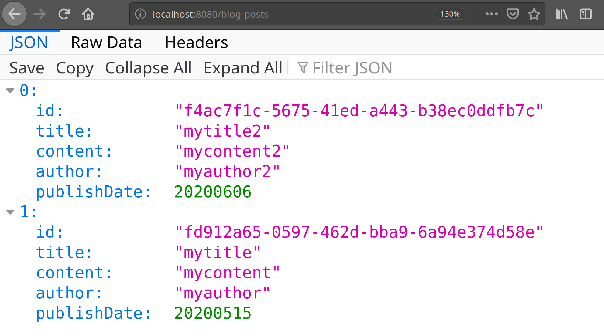

# Blog API- Node.JS

CRUD API for blogging platform. Built from scratch with `npm` and Express. Handles GET and POST requests to `/blog-posts`. DELETE and PUT requests go to `/blog-posts/:id`. 

## Summary

- **Code repository [home](https://github.com/MiguelNiblock/node-blog-api)-** Github repo for the project.
- **Live code on [Glitch](https://glitch.com/edit/#!/miguelniblock-blog-api)-** Here you can see and edit the code in a simple web IDE. 
- **Live [endpoint](https://miguelniblock-blog-api.glitch.me/blog-posts)-** Glitch allows you to deploy node apps and provides you with a URL of your choice. This would be our main endpoint for sending HTTP requests to.

## Details

### GET all posts

If you open the live app URL: [https://miguelniblock-blog-api.glitch.me/blog-posts](https://miguelniblock-blog-api.glitch.me/blog-posts), your browser will receive a response with a JSON file that contains all the blog posts in the storage model. In this case, it only has some sample content.

### GET, PUT and DELETE blog posts by :id

If you then take the "id" field of one of those objects, and add it to the URL path, like this: `http://miguelniblock-blog-api.glitch.me/blog-posts/18d124a6-64af-4dbc-9346-943ce6b6e6d3`, you will receive only the JSON data for that blog post. The actual Id's will be different in the future because they are re-generated by the `uuid` JS library whenever I make changes to the source code on Glitch. You could also use an API testing tool, like Postman to send requests and save responses.

The same principle applies to the DELETE and PUT methods. You simply send the request type to the `blog-posts` endpoint of the base domain, followed by the `/:id` of the post you wish to either GET, PUT, or DELETE. Though with PUT, the API expects a request body with the new data to update to. Below is an example of adding data to a request body in Postman.

### POST a new blog post

In this screenshot we're sending a POST request to the URL `miguelniblock-blog-api.glitch.me/blog-posts`, with a body containing a JSON object with the fields used by the storage model. After sending this request, this new post is available when we send new GET requests, as described above.

